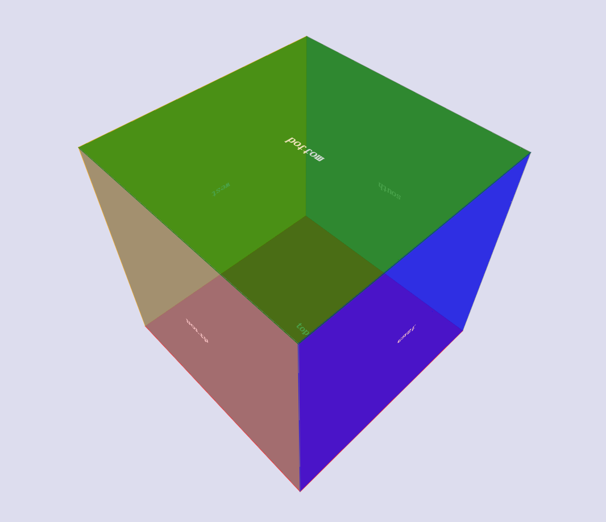

## Web 3D技术 的案例分析与探索 (1)

### Web 3D技术 的案例分析与探索 (1) : 惯性滚动 

案例:  [探秘腾讯](http://admin.bitauto.com/EditorTest/wanglin/wic-tencent/finial/)

我们对其进行了解析, 初步分为5个部分 .

分别为 

- 预加载模块 -> [part1](http://admin.bitauto.com/EditorTest/wanglin/wic-tencent/part1-imgolad/part1.html)

- 星空背景模块 -> [part2](http://admin.bitauto.com/EditorTest/wanglin/wic-tencent/part2/part2.html)

- 手势解除锁定模块- >[part3](http://admin.bitauto.com/EditorTest/wanglin/wic-tencent/part3/part3.html) 

- 惯性运动的3D 模型 -> [part4](http://admin.bitauto.com/EditorTest/wanglin/wic-tencent/part5/fake/index.html)

- 重力感应(陀螺仪) 的3D模型  

  ​

  ​

  ​

  重力感应版

  

`预加载` 和` 移动星空`  ,以及`手势解锁` 都是很不错的交互, 也很值得学习吸收, 这里主要研究 `Web 3D`  相关技术,故略去.

## 概要

现在的web 端 3D 技术 我们简单的粗浅的划分可以分为2类.

- 伪3D技术 ,通过2维的平面的图,(例如 全景图), 视觉误差等方法实现的 可以乱真的效果的图.
- 真3D模型. 通过3D 模型, 提供各个视角的真实的3D物体.

腾讯  [探秘腾讯](http://admin.bitauto.com/EditorTest/wanglin/wic-tencent/finial/)  案例中使用的是全景图的方式 ,包括淘宝的[造物节](),以及天猫双11的 [宇宙邀请函](http://invite.jeejoy.com/index.html) 也都属于第一种(所不同的是全景图的制作方式). 

 

###  3D Web 技术有以下可选技术栈：

- CSS3（本文所提及的方式）

- Three.js 

- krpano（为全景而生，低级浏览器则回退到 Flash）

- A-frame

  ​

  当然，也许还有其他的:)

  ​

  恩,以上几个方向也是我们现在正在进军研究方向.

  ​

  :)

##  关于实现

看图说话, 

我们构造出这么个模型,3D 的六面体. 我们加上`惯性运动` 之后, 这个六面体就可以随着 `手指(/或鼠标)的滑动`  / `鼠标滑动` , 像这样 [CUBE](http://admin.bitauto.com/EditorTest/wanglin/wic-tencent/part5/fake/index.html)  . 

恩,这貌似和我们需要的3D 效果,和 那种辽阔感没多大关系.  恩,加几个参数

- 我们需要把我们的魔方放大10-100倍,

- 然后想想一下我们在魔方内部, 六个面不是色彩颜色,而是完整的图片背景(比如宇宙背景).

  ​

所以我么看到的就是 这样: [星空](http://admin.bitauto.com/EditorTest/wanglin/wic-tencent/part4/)

done :)

实现的另一部分 : UI 

 ### 关于UI层的实现

 我们会思考,这样的场景搭建 会需要极高的ＵＩ设计成本，需要专业的设备来构造这样的３Ｄ立体空间的环境吗？ 

答案是: 不会.

针对 腾讯案例 来说明, 通过解析, 可以发现,可以拆解重新组装一下之后是这样

如图:

恩,就是一张可以展开成6面的**平面图** ,  没有特殊角度拉伸,没有特殊形变的单纯的平面图 .  只不过 大小 为....6721x1136. 仅此而已. 在设计成本上,并没有任何附加. 这是魔方实现方法的 优点之一.

那么,我们需要做的是, 想象力:)

从设计角度来看,我们的画布从以前的640x11366, 到3D空间环境中的 8000x8000 甚至更大.

 如何运用和调度空间以及如何闭合空间是重点. 

腾讯给出的答案是 广度上 的扩充, 阿里的 造物节是 广度 的扩充, 宇宙邀请函是 深度上 纵向的深入. 都很很有想象力的思路. 

提一个正确的问题 

> 当画布空间扩展到8000x8000 的时候 , 怎么挥霍空间?
>
> :)

以上是基于立方体模型的实现(我们可以成为魔方),  至于基于 `Three.Js` ,` WebGL`  甚至 `Web VR` 等其他技术栈的实现方法, 敬请期待我们 组 小伙伴们的 研究成果.  :)

Git: http://172.20.4.56:3141/wanglinzhizhi/wic-tencent

## 结语

作为系列的第一篇,得有一个拉风的结语

> Hello, new world
>
> :)

前端开发部 

by wanglinzhizhi

